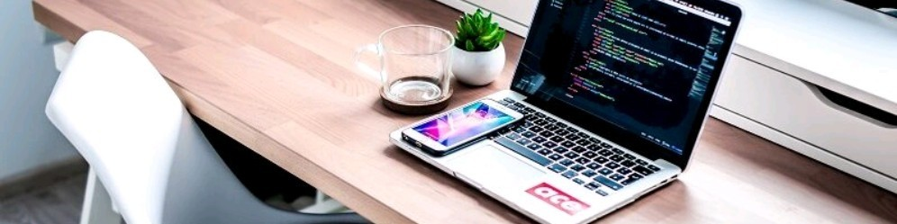

---

Greetings! I'm Dustin Meyer and I'm currently apprenticing as an IT specialist for application development.

**Most experiences with:**

 &nbsp;&nbsp;
 &nbsp;&nbsp;
 &nbsp;&nbsp;
 &nbsp;&nbsp;
 &nbsp;&nbsp;
 &nbsp;&nbsp;
 &nbsp;&nbsp;
 &nbsp;&nbsp;

**Some experiences with:**

 &nbsp;&nbsp;
 &nbsp;&nbsp;

**Connect with me:**

<a href="https://linkedin.com/in/dustindm"> &nbsp;&nbsp;</a>
<a href="https://discordapp.com/users/330380702505762817"> &nbsp;&nbsp;</a>
<a href="mailto:public@dustin-dm.de"> &nbsp;&nbsp;</a>

